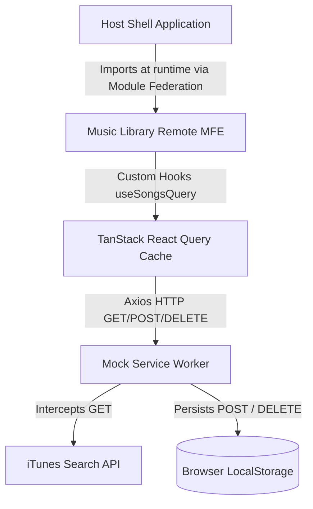

# FinacPlus Music Library Portal

A production-ready Music Library application built with React 19, TypeScript, and Vite that demonstrates a Host–Remote Micro Frontend (MFE) architecture using Module Federation, TanStack React Query, Mock Service Worker (MSW), and Role-Based Access Control (RBAC).

---

## Live Demo Links

- **Main Application (Host Shell)**: [https://finacplus-music-library-host.vercel.app](https://finacplus-music-library-host.vercel.app)
- **Micro Frontend (Remote Manifest)**: [https://music-library-dun.vercel.app/assets/remoteEntry.js](https://music-library-dun.vercel.app/assets/remoteEntry.js)

---

## Demo Login Credentials

| Role | Username | Password | Access & Permissions |
|:---|:---|:---|:---|
| **Administrator** | `admin` | `admin123` | Full access (View, Filter, Sort, Group, Add Songs, Delete Songs) |
| **Viewer / User** | `user` | `user123` | Read-only access (View, Filter, Sort, Group — Add/Delete controls hidden) |

---

## Tech Stack & Architecture

| Category | Technology / Library |
|:---|:---|
| **Frontend Framework** | React 19 + TypeScript |
| **Styling** | Tailwind CSS v3 |
| **Build System** | Vite v5 |
| **Micro Frontend** | `@originjs/vite-plugin-federation` (Module Federation) |
| **Server State Management** | TanStack React Query v5 + Axios |
| **Form Management** | React Hook Form (with numeric & range validation) |
| **Network Mocking** | Mock Service Worker (MSW 2.0) |
| **Cloud Deployment** | Vercel (Monorepo deployment) |



- **Host Shell Application**: Manages layout navigation, in-memory JWT authentication (`AuthContext`), route protection, and dynamically mounts the Remote MFE component via `React.lazy()` and `<Suspense>`.
- **Music Library Remote MFE**: Exposes `./MusicLibraryApp` containing the complete music registry view, filter bar, card grid, and song modal.
- **Mock Service Worker (MSW)**: Intercepts `POST /songs` and `DELETE /songs/:id` HTTP requests in the browser, persisting added and deleted song records in `localStorage`.

---

## Features & Implementation Highlights

### 1. Music Library UI & Native Data Operations
- **Live iTunes Integration**: Reads data from the live iTunes Search API (`https://itunes.apple.com/search?term=rock&entity=song`) and normalizes raw fields (`trackName`, `artistName`, `collectionName`, `releaseDate`) into clean domain interfaces.
- **Client-Side Filter, Sort, Group**: Filter by Title/Artist/Album with a 300ms search input debounce; sort alphabetically or by release year; group by Artist or Album using native JavaScript `.filter()`, `.sort()`, and `.reduce()` operations wrapped in `useMemo`.
- **Loading & Error UI**: Animated skeleton loader grid during data fetching; interactive error callout with a **"Retry Connection"** button on failure.

### 2. Authentication & Role-Based Access Control (RBAC)
- **In-Memory JWT Auth**: Generates synthetic JWT tokens on login (`mock-jwt-header.payload.signature`) and rehydrates sessions from `localStorage`.
- **Role Permissions**: `admin` role grants full read/write access. `user` role locks the layout into read-only mode, hiding the **"+ Add Song Record"** button and card **Delete** buttons from the DOM.

### 3. Add & Delete Song Operations (Admin Only)
- **`react-hook-form` Validation**: Uncontrolled input form validating required fields, `valueAsNumber` conversion, and release year constraints (1800–2100). Includes focus trapping and `Escape` key accessibility.
- **Optimistic UI Mutations**: Deletions immediately remove the target card from the React Query cache using `onMutate`. If the request fails, `onError` restores the snapshotted cache instantly.

---

## How to Run Locally

### 1. Install Dependencies
```bash
npm install
```

### 2. Run Development Servers
```bash
npm run dev
```
- **Host Application**: `http://localhost:3000`
- **Remote Music Library MFE**: `http://localhost:3001`

### 3. Build & Preview
```bash
npm run build
```
*(Executes monorepo build for both projects and merges distribution outputs into `host/dist`)*.

---

## Deployment Strategy

The project is deployed on **Vercel static hosting**. 
During the automated build pipeline (`npm run build`), `music-library` compiles first, exposing `./MusicLibraryApp` and generating `remoteEntry.js`. `host` compiles second, and `scripts/merge-dist.js` copies `music-library/dist` assets into `host/dist/assets/`, preserving `host/dist/index.html` as the primary SPA entry point.

---

## Tradeoffs & Future Improvements

**Architectural Tradeoffs**: To deliver a production-ready, zero-overhead assignment without requiring a dedicated hosted Node/Express backend server on Render or Railway, we chose to run **Mock Service Worker (MSW 2.0)** directly inside the browser, persisting custom song mutations in `localStorage`. While this provides an authentic network layer with real React Query caching lifecycle states (`useQuery`, `useMutation`, loading, error), it limits data persistence to the individual user's browser session rather than a shared cloud database. Additionally, to avoid context provider duplication across Module Federation build outputs, we passed Host context utilities (such as Toast notification handlers and active user role) as explicit React props across the federation boundary—trading implicit Context reliance for explicit component boundaries.

**Future Improvements with More Time**: If granted additional time, we would implement a real PostgreSQL database with a Prisma ORM REST API backend, replace synthetic JWTs with OAuth2 / Auth0 authentication, implement End-to-End automated testing using Playwright/Cypress, and add WebSocket support for real-time collaborative music library updates across multiple connected browser clients.

---

## Author

Built for the **FinacPlus Frontend Internship Assignment** (Toorak Capital Partners project team).
