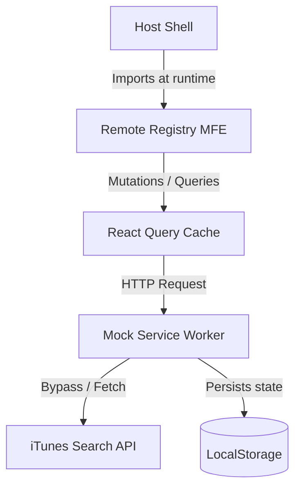

# FinacPlus Music Library Portal

A music library application built with React, TypeScript, and Vite that demonstrates a Host–Remote Micro Frontend architecture using Module Federation.

## Highlights
- React 19 + TypeScript
- Micro Frontend Architecture
- Vite Module Federation
- TanStack React Query
- Mock Service Worker (MSW)
- Role-Based Authentication
- Optimistic Updates
- Responsive Design
- WCAG Accessibility
- Vercel Deployment

---

## Live Demo
- **Host Application**: [https://host-eight-beta.vercel.app](https://host-eight-beta.vercel.app)
- **Remote Micro Frontend**: [https://music-library-dun.vercel.app](https://music-library-dun.vercel.app)

---

## Project Preview

*Note: Screenshots are not included in this repository. Placeholders indicate where assets should be placed:*

- **Login View**: `docs/login.png`
- **Dashboard View**: `docs/dashboard.png`
- **Music Library View**: `docs/library.png`
- **Add Song View**: `docs/add-song.png`

---

## Tech Stack

| Category | Technology |
|:---|:---|
| **Frontend** | React 19 + TypeScript |
| **Styling** | Tailwind CSS |
| **Build Tool** | Vite |
| **Micro Frontend** | Module Federation |
| **Data Fetching** | TanStack React Query + Axios |
| **Forms** | React Hook Form |
| **Mock API** | MSW |
| **Deployment** | Vercel |

---

## Architecture

This project splits a dashboard portal into two separately built apps that merge in the browser.



- **Host Shell**: Provides the wrapper layout, manages authentication, guards routes, and dynamically mounts the Remote MFE.
- **Remote MFE**: Exposes the music registry component. It can be run and tested standalone on its own port.
- **Mock Service Worker (MSW)**: Intercepts Axios requests at the browser network layer to make them look like real backend API calls, serving and mutating a local database cached in `localStorage`.

---

## Folder Structure

```
finacplus-music-library/
├── host/                     # Host Shell Application (Port 3000)
│   ├── src/
│   │   ├── layouts/          # Layout wrappers and navigation side navs
│   │   ├── pages/            # Dashboard page & MFE lazy-load mount container
│   │   └── main.tsx          # Launches MSW and starts the Host
│   └── vite.config.ts        # Module Federation imports setup
│
├── music-library/            # Remote Music Registry (Port 3001)
│   ├── src/
│   │   ├── features/music/   # Cards, FilterBar, AddSongModal views
│   │   ├── hooks/            # React Query hooks for fetching and mutations
│   │   └── services/         # Axios API connection layer
│   └── vite.config.ts        # Exposes MusicLibraryApp component
│
├── package.json              # Monorepo workspaces config
└── README.md
```

---

## Features

### Authentication
- **Mock Session Token**: Form submissions generate a base64-encoded mock session token, securing subsequent routes.
- **Role-Based Access Control**: Login determines view permissions. Administrators (`admin`) receive full write access, while Viewers (`user`) are locked into a read-only layout where modification elements are removed from the DOM.
- **Protected Routing**: Navigation guards intercept unauthenticated address requests, redirecting them to the login layout.

### Dashboard
- **Time-Based Greeting**: Banner displays warnings and greetings based on system clock hours ("Good Morning", "Good Afternoon", "Good Evening").
- **Dynamic Stats**: Calculates total songs, unique artists, and unique albums from the active list.
- **Activity Timeline**: Reads recent user actions (logins, additions, deletions) persisted locally.

### Music Library
- **Registry Controls**: Search, sort, and group controls.
- **Registry Grouping & Sorting**: Alphabetical sorting, newest/oldest filters, and groupings by Album or Artist.

### Performance
- **Search Debounce**: A 300ms input timeout delay optimizes CPU cycles during filtering.
- **Optimistic State Deletions**: Instantly hides deleted song cards. If the API fails, the hook automatically restores the previous state from cache.

### Accessibility
- **Focus Trapping**: Keyboard Tab navigation wraps securely inside open dialogs.
- **Keyboard Triggers**: `Escape` keypresses close active modals immediately.
- **Screen Reader Hooks**: Every form input utilizes corresponding `<label>` selectors, and elements are labeled with strict ARIA tags (`role="dialog"`, `aria-required`, `aria-invalid`).

---

## Technical Decisions

### Bypassing MFE Context Isolation
* **Challenge**: Importing context files (like our Toast Notifications) in separately built remote MFE packages compiles them into two distinct JS context references. The remote MFE won't find the Host's mounted provider in its render tree.
* **Approach**: Passed Host context operations (like the Toast message trigger) down as React props directly to the Remote MFE container. The Remote falls back to its local context only when running standalone.

### Mock Database Persistence
* **Challenge**: Standard MSW in-memory variables wipe out whenever the browser refreshes.
* **Approach**: We read and write changes (custom added/deleted songs) directly to `localStorage` inside the MSW mock handlers. This ensures mock updates persist across tab refreshes.

### Client-Side State Mutations
* **Challenge**: Deleting a song needs to update the UI instantly without waiting for network confirmations.
* **Approach**: Implemented optimistic updates in React Query. Deletions modify the UI immediately. If the API fails, the mutation's context snapshot rolls back the UI.

---

## Getting Started

### 1. Install Packages
*(Uses legacy peer resolution to bypass React 19 package warnings)*
```bash
npm install --legacy-peer-deps
```

### 2. Start Dev Servers
```bash
npm run dev
```
* Host Portal: [http://localhost:3000]
* Remote Sandbox: [http://localhost:3001]

### 3. Check and Build
```bash
# Lint checks
npm run lint --workspace=host
npm run lint --workspace=music-library

# Build
npm run build
```

---

## Deployment

1. **Deploy Remote MFE**: Upload the `music-library` directory to Vercel. Dynamic assets are served directly from the remote domain.
2. **Configure Environment Variable**: Set the `VITE_REMOTE_URL` environment variable in the Host's Vercel settings pointing to the deployed Remote URL.
3. **Deploy Host**: Upload the `host` directory to Vercel. 
4. **Validation**: Open Chrome DevTools Network Tab and verify `remoteEntry.js` loads successfully with HTTP 200 and no CORS warnings.

---

## Test Accounts

| Role | Username | Password | Access Level |
|:---|:---|:---|:---|
| **Administrator** | `admin` | `admin123` | Full access (Write + Read) |
| **Viewer** | `user` | `user123` | Read-only access |

---

## Author

Built as part of the FinacPlus Frontend Internship assignment.
